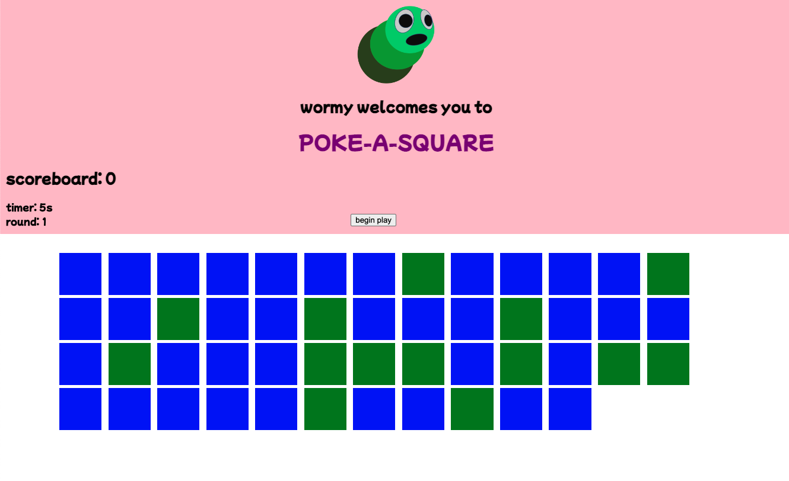

Want to see this app in action? You're in luck! It has been deployed at: <b>https://brilliant-pegasus-b418d4.netlify.app</b>


### Poke A Square

- We're going to make a game that looks like the following:
  


- The objective of our game is to click on as many blue squares as possible during the alloted time

### Let's begin 

- the first step we are going to tackle is the activating the begin button and load the squares

```javascript
  $('button').on('click', () => {

   console.log('this is working')

  })
```


- Now we need to write a function named (createSquares) that sets up our squares, Try to write a function that takes a parameter `numberOfSquares` that will create an arbitary number of divs depending on the parameter and attach them to the squares class from the html. 

```javascript
  const createSquares = (numberOfSquares) => {
    for (let i = 0; i < numberOfSquares; i++){
        const square = $('<div/>')
        $('.squares').append(square)
    }
  }
```

- lets call createSquares in the start button function

```javascript
  $('button').on('click', () => {

    createSquares();

  })

```
- Now we have a bunch of blue squares, but we want our squares to have a random, red, blue, or green color try to write a function to make that happen.


```javascript
const applyRandomColor = (square) => {
  const randNum = Math.ceil(Math.random() * 3)

    if(randNum === 1) {
      square.css('background-color', 'red')

    } else if(randNum === 2){
      square.css('background-color', 'blue')

    }
    else {
      square.css('background-color', 'green')

    }
}
```

-  Where do we use that function?

```javascript
const createSquares = (numberOfSquares) => {
  for (let i = 0; i < numberOfSquares; i++){
      const square = $('<div/>');

        applyRandomColor(square);

      $('.squares').append(square);
  }
}
```

-  Now that we have colored squares, lets make them clickable, and hidden when we click on them.  Give it a try!


```javascript
const createSquares = (numberOfSquares) => {
   for (let i = 0; i < numberOfSquares; i++) {
	const square = $('<div/>');
	applyRandomColor(square);
	square.on('click', handlePoke);
	$('.squares').append(square);
   }
}


const handlePoke = (e) => {
    console.log(e.target)
    $(e.target).css('opacity', 0);
  };
```
- we can make this simple by using jQuery's css method to make the opacity go to zero. 

-  Okay now how do we know if we are clicking on a blue square or not?
-  we can use the css method again like this!

```javascript
const handlePoke = (e) => {
    console.log(e.target)
    $(e.target).css('opacity', 0);
    const color = $(e.target).css('background-color');
  };
```

- `console.log(color)` it should return something like this `'rgb(0, 0, 255)'`

- So how can we use that, lets write a function that takes that string and if it is blue lets update a global `score` variable.

- create your score variable at the top like the following: 

```javascript
   let score = 0;
```

-  One way to do it is like the following

```javascript
const checkValidPoke = (square) => {
  console.log(square, typeof square)
  const colors = square.substring(4, square.length-1).split(", ");
  const blue = colors[2];

  if(blue === '255'){
    score++;
  } else {
    score--;
  }
  console.log(score)
}
```

  - substring lets us take out part of a string.
  - then we are splitting the string by the places so we can get an array number of strings then we access the second index item in the newly created array because we only care about the blue value in rgb

  - now where do we use this? 

```javascript
const handlePoke = (e) => {
      console.log(e.target)
      $(e.target).css('opacity', 0);
      const color = $(e.currentTarget).css('background-color');
      checkValidPoke(color)
   };
```

- Now lets update the dom with the value of score, give it a try! (Hint: you can do it in the function you just made)

```javascript
const checkValidPoke = (square) => {
  console.log(square, typeof square)
  const colors = square.substring(4, square.length-1).split(" ");
  const blue = parseInt(colors[2])

  if(blue === 255){
    console.log('this is passign')
    score++;
  } else {
    score--;
  }
  $('h1').text('scoreboard: ' + score)
}
```

- We got alot of the gameplay working now lets set up our timer

- Set up some variables by the score variable like the following 

```javascript
let score = 0;
let time = 30;
let round = 1;
```

- now try to write a function called `updateTimer` thats countsdown to 0 and when it reaches 0 increase the round and restarts the time. Then let's call that function every second.

```javascript
const updateTimer = () => {
	time--;
	$('#timer').text(`timer: ${time}s`);
	if (time === 0) {
		time = 30;
		round += 1;
		setUpRound();
	}
};

setInterval(updateTimer, 1000);
```

- Now write a function called setupRound, that will change the round number on the DOM and set up a new game, if we do this we can just call it in the button so we can reuse that button every round!

```javascript
 const setUpRound = () => {
    $('.squares').empty();
    $('#round').text('round: ' + round)

    if(round === 1){
      createSquares(50);
    } else if(round === 2){
      createSquares(100);
    } else if(round === 3){
      createSquares(150);
    } else {
      createSquares(250);
    }
 }

```

- We can add some logic here to make the game easier

- Now lets just call our `setUpRound` function in the button

```javascript
  $('button').on('click', () => {

    setUpRound();
    setInterval(updateTimer, 1000);

  })

```


-  This has meant our requirements or in other words our MVP (minimum viable product)

___

### Extras

- Make it so the user can lose the game if they don't click all of the blue squares.
- Make the squares lose transparency during each round so you have to click faster.
- Make a Modal to gather the players name at the beginning of the game, and leave them a greeting in the header
- Can you refactor your code to encapsulate your methods and variables in an object
- Style it make it look nice
- Make a sound when you click a wrong one or a right one.
- have a modal pop up at the begining of a ready so the user knows how to continue
- make a section about how to play the game (how do you want to do that? an About page, in the header, a modal, idk???? anything you can imagine)
- Anything you can imagine, any twist, any turn you like, USE USE USE your imagination in this, it will allow you to create worlds!
